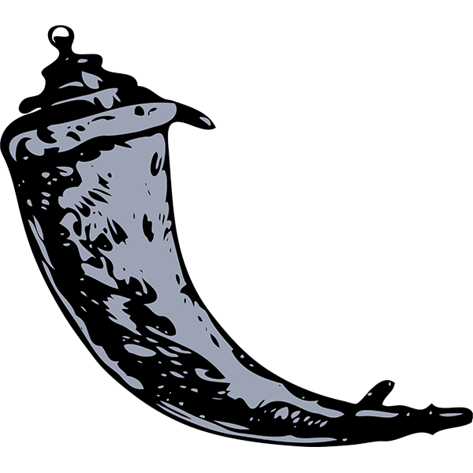
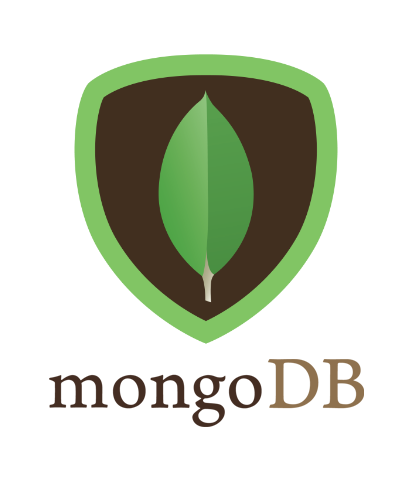

## Hi there 👋, I'm Stephen

I'm a Computer Science student at University College Cork, currently in my third year.

I'm interested in software development, cybersecurity, cloud infrastructure, and data systems. I enjoy building projects that combine programming with real-world problems.
<h2>🌐 Connect with Me</h2>

<!-- <section>

</section> -->

<h1>🛠️ Technologies & Tools</h1>
<h2>👨‍💻 Languages
</h2>
<section>
 
</section>
<h2>🌐 Web</h2>
<section>
  
</section>
<h2>🛢️ Databases</h2>
<section>
  
</section>
<!--
**Slanders23/Slanders23** is a ✨ _special_ ✨ repository because its `README.md` (this file) appears on your GitHub profile.

Here are some ideas to get you started:

- 🔭 I’m currently working on ...
- 🌱 I’m currently learning ...
- 👯 I’m looking to collaborate on ...
- 🤔 I’m looking for help with ...
- 💬 Ask me about ...
- 📫 How to reach me: ...
- 😄 Pronouns: ...
- ⚡ Fun fact: ...
-->
